# Practical_Project1 (21900156 Kim YeJun)
## JAVA CRUD PROJECT
- **영단어를 검색, 추가, 수정, 삭제 파일저장, 수준별 단어보기, 모든 단어보기 기능을 가진 프로그램을 만든다.**       
  

## [결과  Screenshot](https://github.com/ye450450/Practical_Project1/tree/master/sreenshots)
- **실행결과의 screenshots으로 잘 실행되고 있는지 확인한다.**
### [설치한 IDE 캡쳐](https://github.com/ye450450/Practical_Project1/blob/master/sreenshots/%EC%8B%A4%ED%96%89%ED%99%94%EB%A9%B4.png)
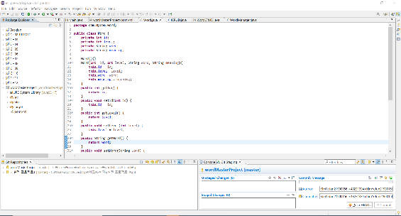

### 1. 모든단어보기 [1](https://github.com/ye450450/Practical_Project1/blob/master/sreenshots/%EB%8B%A8%EC%96%B4%EB%B3%B4%EA%B8%B01.PNG) , [2](https://github.com/ye450450/Practical_Project1/blob/master/sreenshots/%EB%8B%A8%EC%96%B4%EB%B3%B4%EA%B8%B02.PNG)
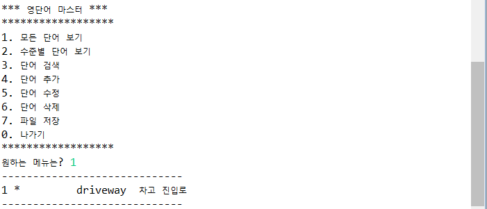
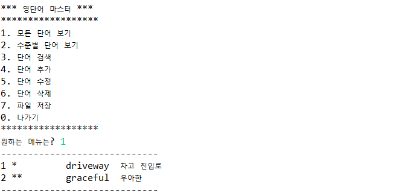

### [2. 수준별 단어보기](https://github.com/ye450450/Practical_Project1/blob/master/sreenshots/%EC%88%98%EC%A4%80%EB%B3%84%20%EB%8B%A8%EC%96%B4%20%EA%B2%80%EC%83%89.PNG)

### [3. 단어 검색](https://github.com/ye450450/Practical_Project1/blob/master/sreenshots/%EB%8B%A8%EC%96%B4%EA%B2%80%EC%83%89.PNG)
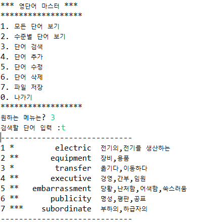

### 4. 단어추가 [1](https://github.com/ye450450/Practical_Project1/blob/master/sreenshots/%EB%8B%A8%EC%96%B4%EC%B6%94%EA%B0%801.PNG) , [2](https://github.com/ye450450/Practical_Project1/blob/master/sreenshots/%EB%8B%A8%EC%96%B4%EC%B6%94%EA%B0%802.PNG)
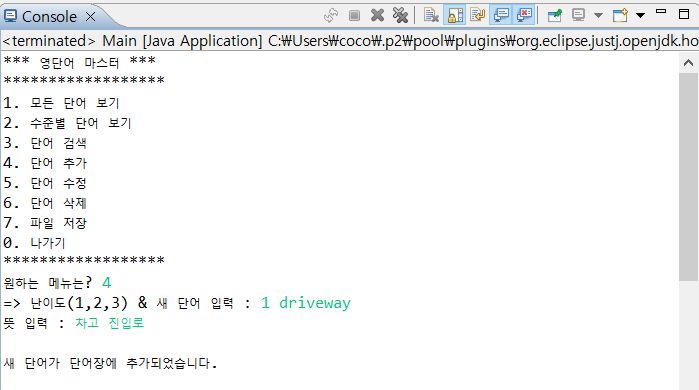
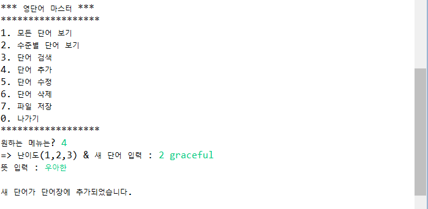

### 5. 단어수정 [1](https://github.com/ye450450/Practical_Project1/blob/master/sreenshots/%EB%8B%A8%EC%96%B4%EC%88%98%EC%A0%951.PNG) , [2](https://github.com/ye450450/Practical_Project1/blob/master/sreenshots/%EB%8B%A8%EC%96%B4%EC%88%98%EC%A0%952.PNG)
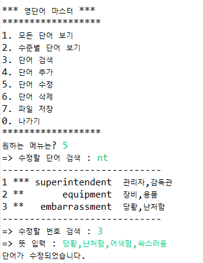
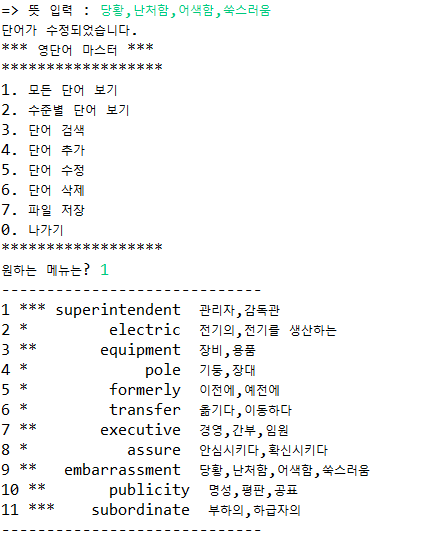

### 6. 단어삭제 [1](https://github.com/ye450450/Practical_Project1/blob/master/sreenshots/%EB%8B%A8%EC%96%B4%EC%82%AD%EC%A0%9C.PNG) , [2](https://github.com/ye450450/Practical_Project1/blob/master/sreenshots/%EB%8B%A8%EC%96%B4%EC%82%AD%EC%A0%9C2.PNG)
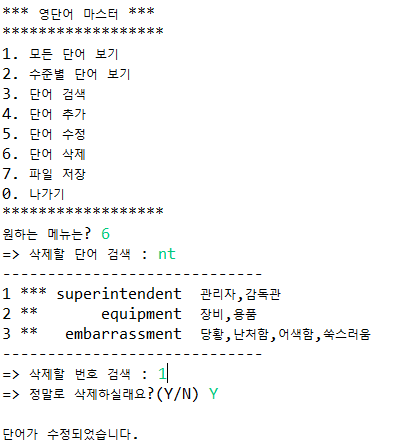
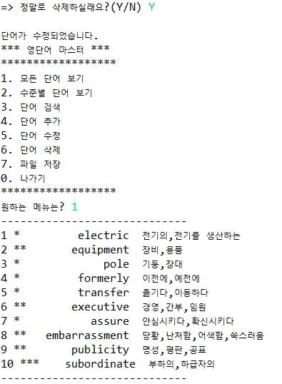

### [7. 파일세이브](https://github.com/ye450450/Practical_Project1/blob/master/sreenshots/%ED%8C%8C%EC%9D%BC%EC%84%B8%EC%9D%B4%EB%B8%8C.PNG)
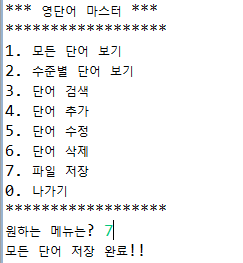

### [0. 나가기](https://github.com/ye450450/Practical_Project1/blob/master/sreenshots/%EB%82%98%EA%B0%80%EA%B8%B0.PNG)
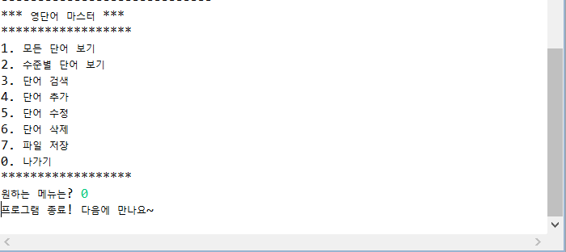

### [파일로드](https://github.com/ye450450/Practical_Project1/blob/master/sreenshots/%ED%8C%8C%EC%9D%BC%EB%A1%9C%EB%93%9C.PNG)
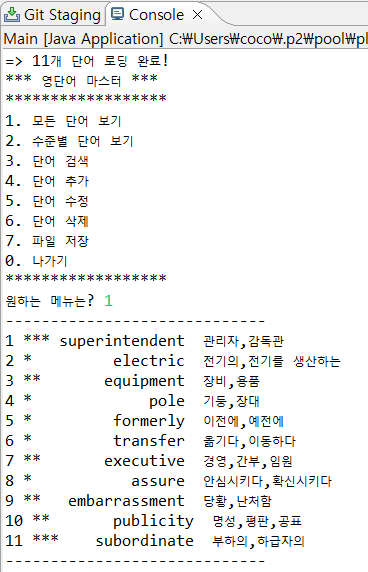

### [문서파일(수정전)](https://github.com/ye450450/Practical_Project1/blob/master/sreenshots/Dictionary%ED%8C%8C%EC%9D%BC(%EC%88%98%EC%A0%95%EC%A0%84).PNG)
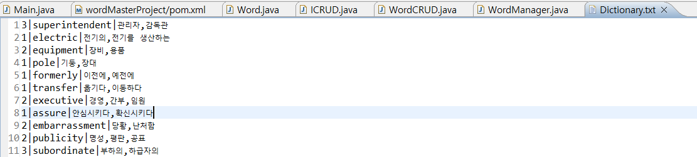

### [문서파일(수정후)](https://github.com/ye450450/Practical_Project1/blob/master/sreenshots/Dictionary%ED%8C%8C%EC%9D%BC(%EC%88%98%EC%A0%95%ED%9B%84).PNG)
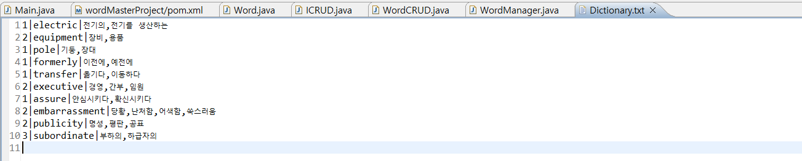
